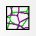
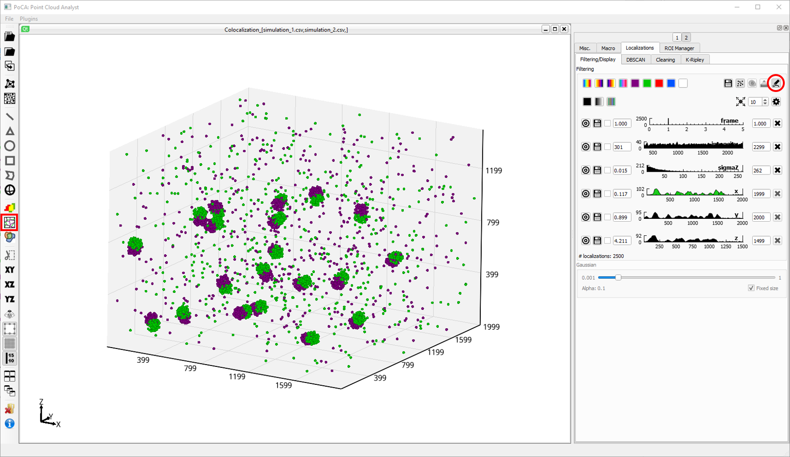
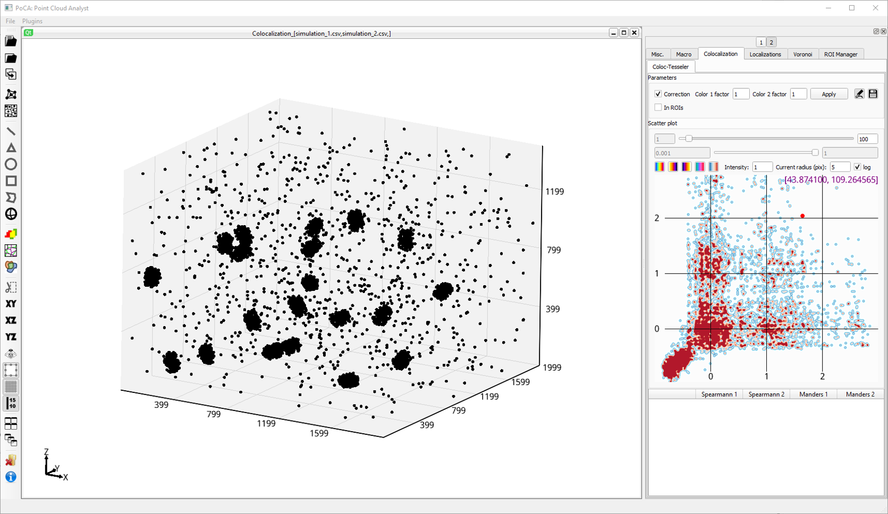
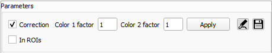
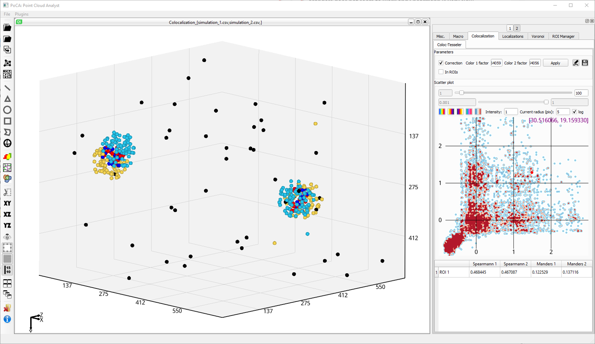
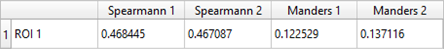

The ***Coloc-Tesseler*** method has been presented in this paper: [A tessellation-based colocalization analysis approach for single-molecule localization microscopy. Nature Communications 10, 2379 (2019)](https://doi.org/10.1038/s41467-019-10007-4).

&ensp;Click this toolbar button to create ***Coloc-Tesseler*** on the colocalization dataset.

	

Beware: the Coloc-Tesseler rendering is under the localization rendering. Please, switch off the rendering of the localizations of both colors (in ***Localizations//Filtering/Display***).

	

Originally, the Coloc-tesseler rendering is black since no threshold has been applied. The scatterplot displays the Coloc-Tesseler pair-density localization descriptor. 

	

Setting the thresholds can be done by using the textboxes or directly clicking on the scatterplot. Applying the thresholds will compute the Spearmann and Manders coefficients, and classify the different localizations.

	

In this case, a crop has been done on 2 clusters for a better visualization. When no ROI is selected, ***ROI 1*** is applied on the full dataset.

	

[Back to main page](README.md)