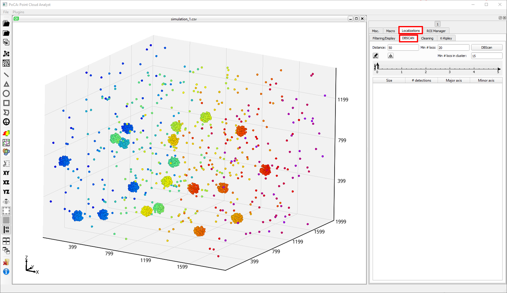
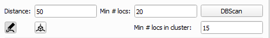
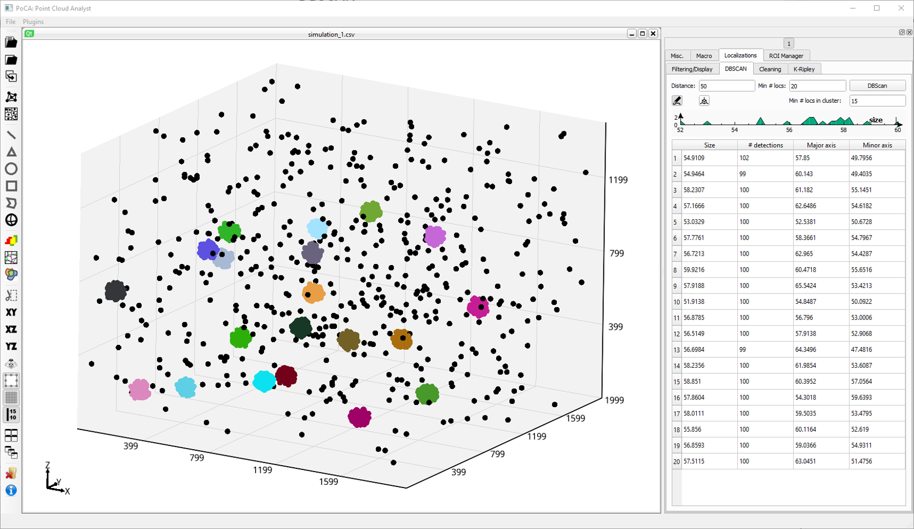

An optimized implementation of [DBSCAN](https://www.aaai.org/Papers/KDD/1996/KDD96-037.pdf) is available in the ***Localizations//DBSCAN*** tabs.

	

DBSCAN uses two main parameters to cluster: a ***distance*** used to compute the localizations' density (designed as ***Eps-neighborhood*** in the original paper) and a ***minimum number of points*** in this distance to classify localizations as core points (***MinPts*** in the original paper).

	

When you click on the ***DBScan*** button, PoCA will compute the clustering with the current parameters. PoCA then compute the size of the different objects and display the results in a table and in an histogram. Beware: objects are not internally stored by PoCA. You need to create them explicit after through the appropriate button to have access to them in the ***ObjectList*** tab.

	

&ensp;Create objects with the current triangles/tetrahedra selected.

&ensp;Toggle rendering of the DBSCAN result.

[Back to main page](README.md)