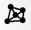
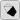
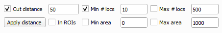

	

&ensp;Clicking the ***Delaunay*** icon in the PoCA toolbar will create a Delaunay triangulation of the point cloud, automatically determining if it has to be in 2D or 3D. 

During the construction of the Delaunay triangulation, a surface (2D point clouds) or a volume (3D point clouds) feature is computed, feature that can be filtered by the histogram.

List of actions available:

&ensp;Invert selection.

&ensp;Toggle rendering of the bounding box of the picked triangle/tetrahedron.

&ensp;Create objects with the current triangles/tetrahedra selected.

&ensp;Fill or not the surface of the triangles/tetrahedra.

&ensp;Toggle rendering of the Delaunay triangulation.

	

When using the Delaunay triangulation the segmentation can be performed by filtering the feature histogram or by applying a cutting distance. Parameters for the creation of objects are available in the section shown above.

[Back to main page](README.md)