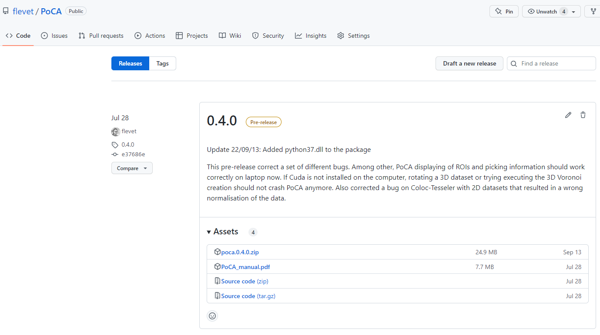
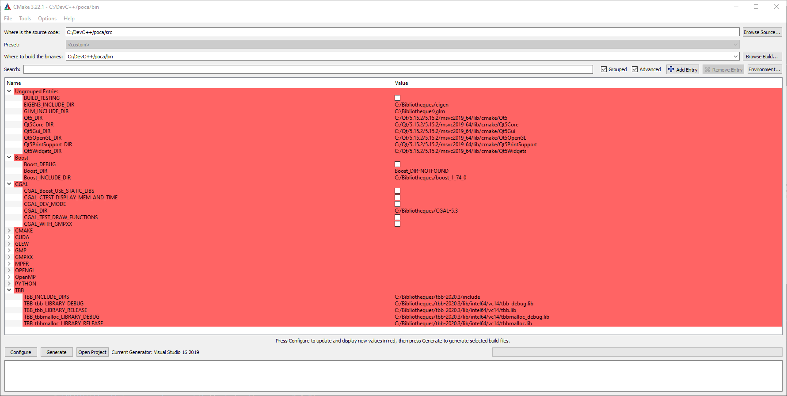

## Installation

Windows binaries are packaged in a zip file and are available in the [***Release***](https://github.com/flevet/PoCA/release) section of the PoCA Github. Un-zip the archive in desired folder and double-click on ***poca.exe***. A few datasets are provided in the ***data*** folder to play with.

	

### Troubleshooting

If upon executing poca.exe Windows asks for dlls such as "VCRUNTIME140_1.dll", you may need to install the ["microsoft visual c++ 2019 redistributable package (x64)"]( https://docs.microsoft.com/en-GB/cpp/windows/latest-supported-vc-redist?view=msvc-160).

For having access to the Voronoi 3D construction, you will need an NVidia card with the latest drivers installed as well as [CUDA](https://developer.nvidia.com/cuda-10.2-download-archive) (tested with 10.2, may work with newest versions).

For communication with Python, you will need to have installed Python 3.7.x (tested with Python 3.7.4).

## Compilation
PoCA is developed in C++ and the code-source is available in the associated [Github](https://github.com/flevet/PoCA). To ease its compilation, there are CMakeLists.txt in each project of the PoCA repository. Nevertheless, some of the libraries are not automatically found and need to be manually added in cmake-gui. 

Required libraries:

* [CGAL](https://www.cgal.org/) (Tested with version 5.3)
* [Boost](https://www.boost.org/) (Tested with version 1.74.0)
* [Qt](https://www.qt.io/) (Tested with version 5.15.2)
* [CUDA](https://developer.nvidia.com/cuda-zone) (Tested with version 11.5)
* [TBB](https://github.com/oneapi-src/oneTBB/releases/tag/v2020.3) (Tested with version 2020.3)
* [Eigen3](https://eigen.tuxfamily.org/)
* [GLM](https://github.com/g-truc/glm) (Tested with version 0.9.9.8)
* [GLEW](http://glew.sourceforge.net/) (Tested with version 2.1.0)
* [Python](https://www.anaconda.com/products/distribution) (Tested with an Anaconda environment and Python version 3.7.4)

	

[Back to main page](README.md)