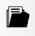

PoCA supports macros for automatizing the analysis of point clouds, with all macros being saved as ***json*** files (with the txt extension). A ***Macro*** tab is available with a ***Recorder*** and a ***Runner***. All commands performed in PoCA are recorded in the recorder. 

	

### Recorder

	

&ensp;Transfer all the recorded commands to the runner.

&ensp;Transfer all the recorded commands to the clipboard.

&ensp;Save all the recorded commands to a json file.

If the user opens a localization dataset (csv file).

	

	

The corresponding command is recorded.

	

The command contains the filename, the calibration, the separator (44 is the ASCII value for ***,***) and the name and position of all the read columns.

This simple macro can be transferred to the runner by clicking on ***Transfer to runner***.

### Runner

	

&ensp;Load a macro in the runner.

&ensp;Save the macro that is currently in the runner textbox.

&ensp;Execute the macro that is currently in the runner textbox.

Modifying the ***path*** parameter of the command to ***simulation_2.csv***, and clicking on ***Run*** will open the localization dataset ***simulation_2.csv***.

When a complete macro is defined, you can apply it to another localization dataset or to a full directory with these buttons. Beware: the macro requires to have as first command ***MainWindow//open*** as it will define how to read the csv files. 

&ensp;Apply the macro to the chosen localization file.

&ensp;Apply the macro to localization files that are in the chosen folder.

[Back to main page](README.md)