After loading a CSV file, a new window opens with the point cloud displayed. The ***Filtering/Display*** tab in the ***Localizations*** tab allows to filter features and change the point cloud visualization mode.

## Visualization

	

In the ***Filtering*** section, we have:

	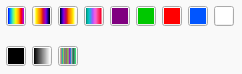

These buttons allows to change the LUT applied to the chosen ***feature***.

	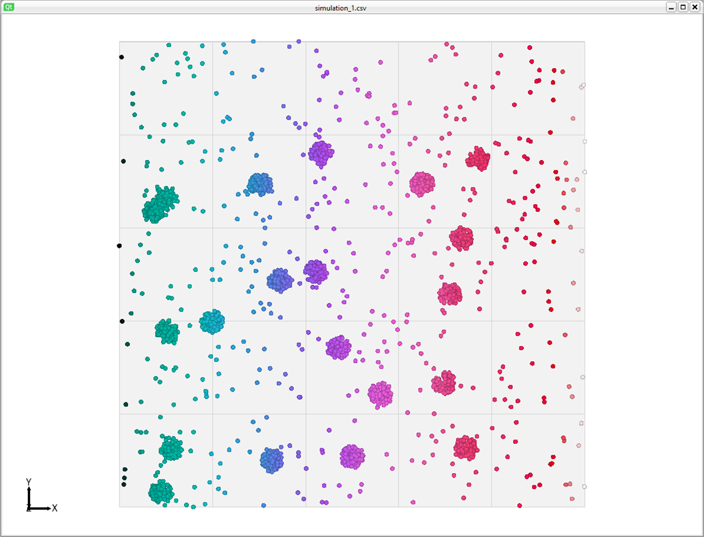

The LUT was changed from ***HotCold*** to ***Ice***.

	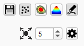

These buttons allows several actions:

&ensp;Save all the localizations with their features.

&ensp;Select the point rendering.

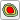&ensp;Select the heatmap rendering.

	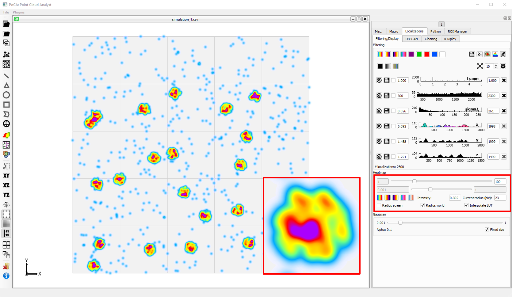

The heatmap rendering project all the localization to the screen and compute a kind of density. As this is done during the rendering step, in the graphics card, this rendering is not quantitative. Parameters to this rendering are available in the ***Heatmap*** section.

&ensp;Select the Gaussian rendering.

	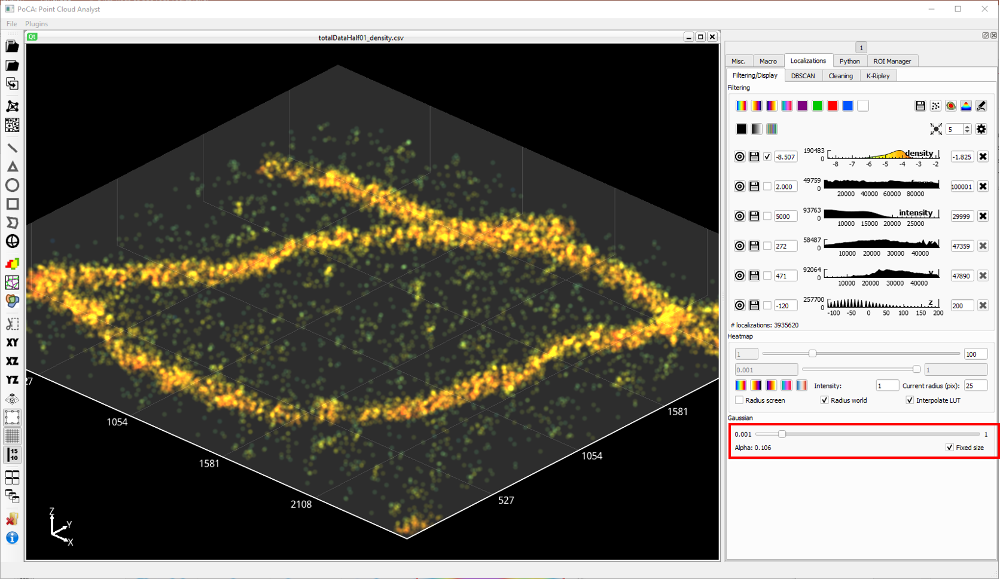

The Gaussian rendering renders the points as Gaussian, in 2D or 3D. It works better with a black background since it requires alpha blending. Parameters are available in the ***Gaussian*** section.

&ensp;Toggle the localization rendering.

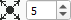&ensp;Define the size of the point to be redering when the point or Gaussian rendering are selected.

## Filtering

	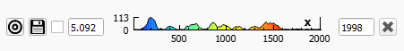

Each feature is represented as an histogram that can be filtered, either by changed the minimum and maximum in the textboxes, or bien clicking on the histogram (left button for changing the minimum, right button for changing the maximum). The ***target*** icon is used to select this feature for applying the LUT on the localizations. The **floppy disk*** is used to save the whole distribution of this feature. The ***checkbox*** is used to convert the feature to a log distribution.

	

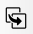&ensp;This button duplicate a localization dataset with the current filtering. It is available in the PoCA toolbar.

## Cropping

3D point clouds can be cropped to facilitate manipulation and exploration. The buttons are avilable in the PoCA toolbar.

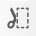&ensp;Toggle cropping. It requires to have first selected the XY, XZ or YZ frame rotation.

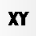&ensp;Rotate the point cloud to the XY frame.

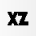&ensp;Rotate the point cloud to the XZ frame.

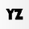&ensp;Rotate the point cloud to the YZ frame.

	

After clicking on the ***crop*** icon, you just have to perform the crop on the point cloud by pressing the left mouse button, moving the crop selection to the desired end and releasing the mouse button.

## Picking

As seen in the Gifs above, when the mouse passes on elements (localizations, objects, etc...), informations about those elements are displayed in a yellow box, directly on the screen. All the features of the elements are displayed.

[Back to main page](README.md)