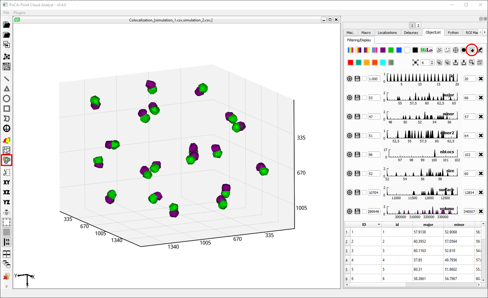
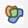
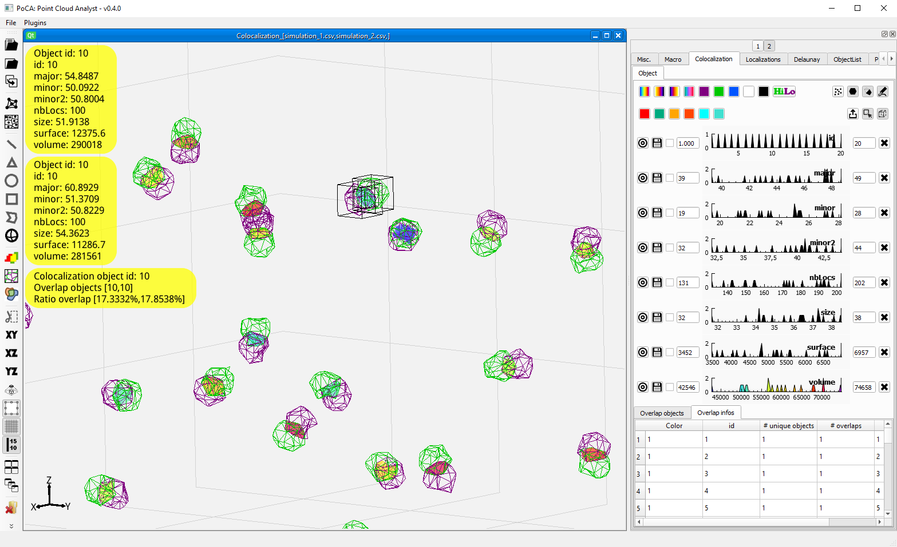
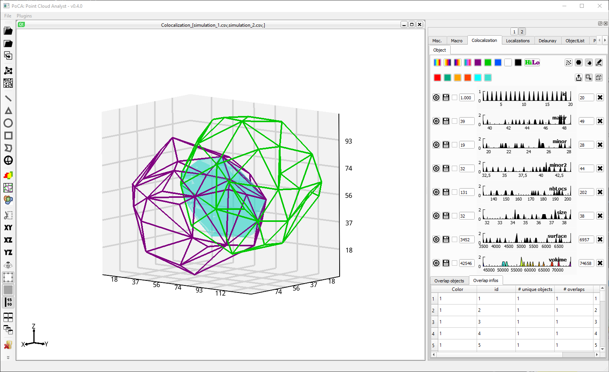
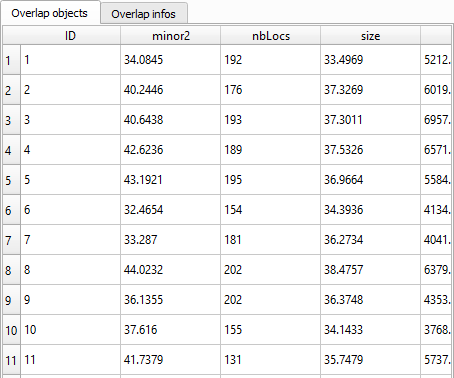
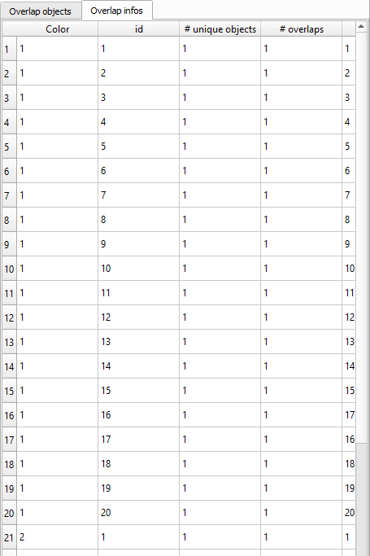

Before being able to compute colocalization between objects, it is required to have created objects for both colors.

	

&ensp;Click this toolbar button to compute colocalization on objects.

After switching the objects rendering for both colors from fill to lines (in ***ObjectList//Filetring/Display***), you can see the colocalization computed.

&ensp;Button used to switch the object rendering from filled to lines (in ***ObjectList//Filetring/Display***).

The colocalization computed is stored as objects, meaning that you have access to all the object features (are, volume, size, etc.) and to picking (double click will automatically crop and magnify the objects picked).

	

	

Statistics on the colocalized regions are displayed in the ***Overlap objects*** table (size, volume, etc.). 

	

The ***Overlap infos*** provides information about, for each object of each color, how many objects of the other color it overlaps with.

	

[Back to main page](README.md)