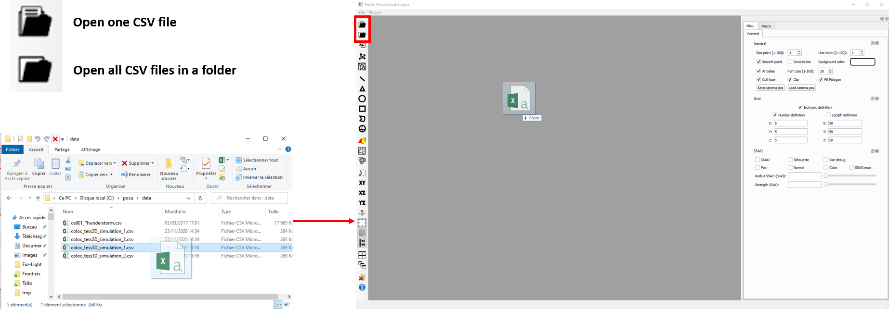
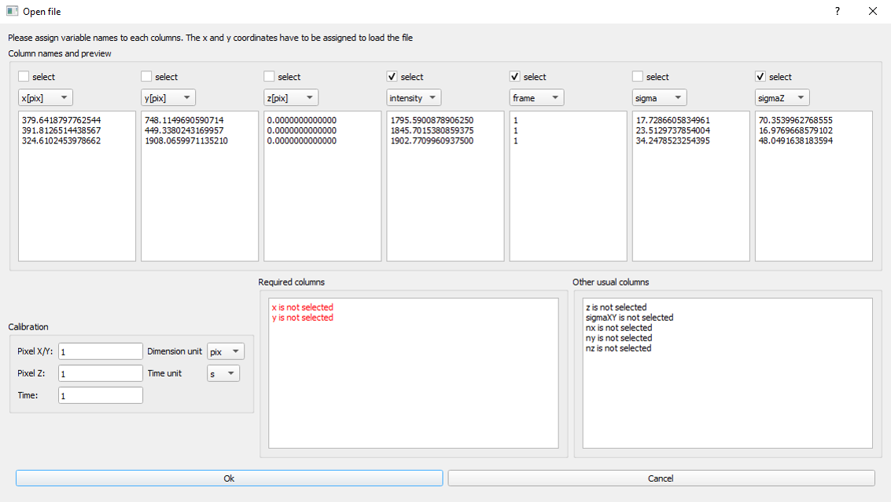
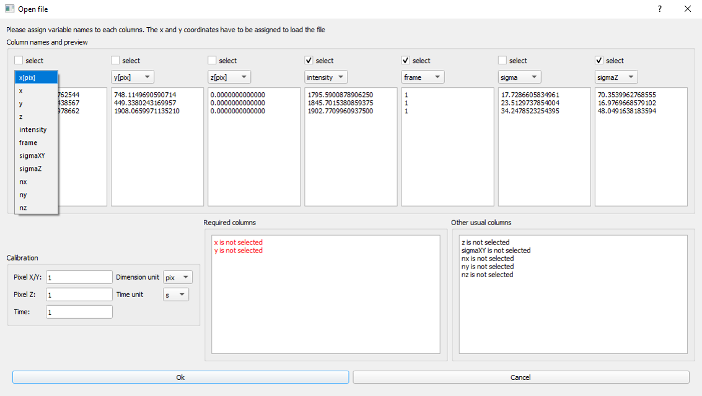
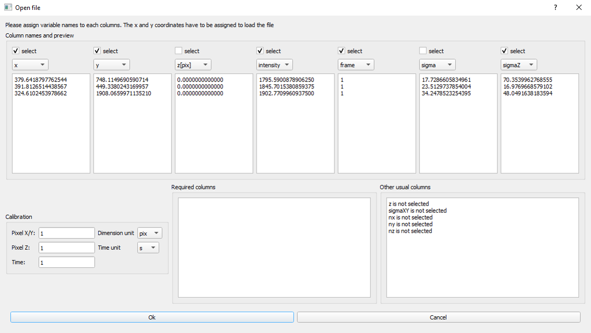

PoCA can open localization files stored as CSV files. You can either drag and drop files, or use the file or folder icons.

	

A new window will pop-up in which a pre-visualization of the CSV columns is displayed. To ease handling features in PoCA, the software is expecting specific names for a handful of features:

* ***x***, ***y*** and/or ***z*** for the localization coordinates. x and y are mandatory.
* ***intensity*** is the intensity of the localizations.
* ***frame*** is time at which the localization was identified.
* ***sigmaXY*** is the uncertainty in the localization layeral position.
* ***sigmaZ*** is the uncertainty in the localization axial position.
* ***nx***, ***ny*** and ***nz*** are the normal coordinates for the localizations.

	

A column will be loaded by PoCA if its ***selected*** checkbox is ckecked. In this example, ***x*** and ***y*** are not selected because the current names in the CSV files are ***x [pix]*** and ***y [pix]***. On the contrary, the ***intensity*** and ***frame*** are selected because the names fit the ones expected by PoCA. You can use the list of one column to specify which expected feature this column corresponds to.

	

 

After changing the ***x [pix]*** and ***y [pix]*** to ***x*** and ***y***, both features have disappeared from the ***Required columns*** section. Finally, you can change the calibration of your data in the ***Calibration*** section.

	

 

Clicking ***Ok*** will load the data with the selected features.

[Back to main page](README.md)