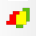

At least, 2 localization datasets have to be already opened.

	

&ensp;Click to open the ***Colocalization*** parameters dialog.

	

You can link up to 4 datasets in a ***colocalization dataset***. Please note that the all the colocalization analysis methods will be performed on the first 2. After selecting the different localization datasets to include in the colocalization dataset, clicking ***Ok*** will close the chosen localization datasets and create a new widget.

	

In this case, we cannot distinguish between the localizations of the two colors. Nevertheless, you can easily switch between each color, to change the LUTs applied to the localization for each color (through the ***Localizations//Filtering/Display*** tabs).

	

&ensp;Buttons to switch between the different colors.

You also have access to all the components of the chosen color (localizations, voronoi diagral, objects, etc.).
 
[Back to main page](README.md)