While PoCA is developed in C++, it can execute Python scripts through a Python interpreter. When using the PoCA Windows binaries, please install a Python environment with a 3.7.4 version of Python.

### Creation of a Python environment

1. Install conda ([Anaconda](https://www.anaconda.com/products/distribution) or [Miniconda](https://docs.conda.io/en/latest/miniconda.html)) on your computer. 
2. Execute a ***Conda command prompt***.
3. Create an environment: ```conda create -n poca python=3.7.4```
4. Activate poca environment: ```conda activate poca```
5. Install the numpy package: ```python -m pip install numpy```
6. Install the scipy package: ```python -m pip install scipy```

### Connect PoCA to the poca Python environment

Go to ***Plugins//Python//Parameters*** to open the dialog to connect to the Python environment.

<p align="center">
	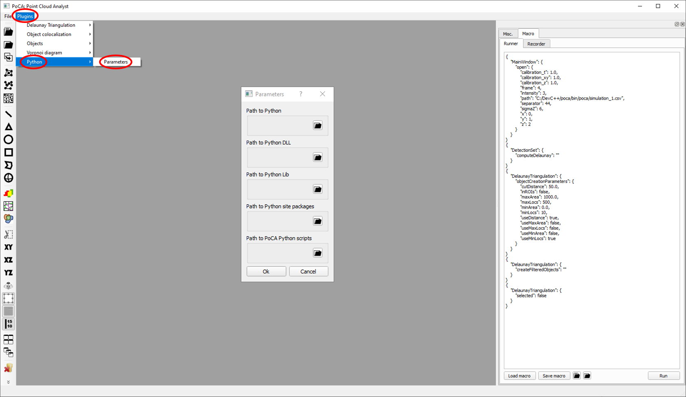
</p>
 
 If your conda is installed in ***c//Users//COMPUTER_NAME//anaconda3***, the environments will be in the ***envs*** folder.
 
<p align="center">
	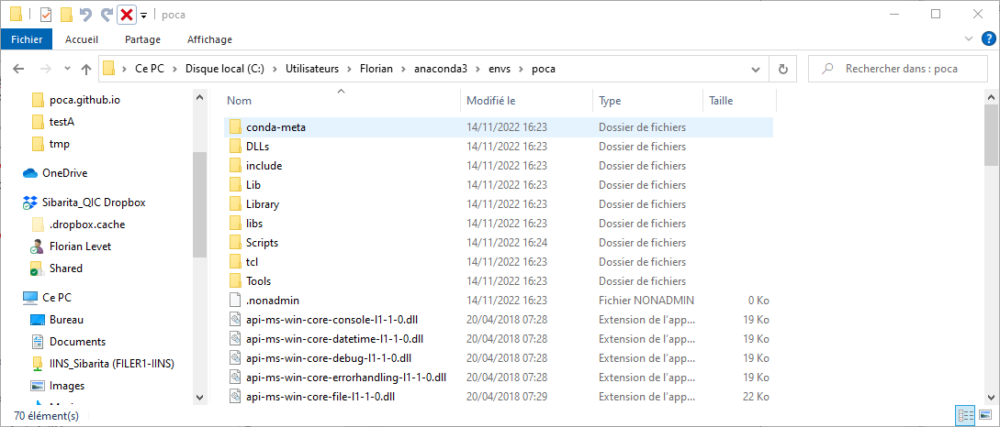
</p>

For the environment, you need to point to the environment folder, to the DLLs folder, to the Lib folder and to the site packages folder. Finally you have to point to a folder in which will be the scripts you want to execute (all the scripts are required to be in the same folder).

 <p align="center">
	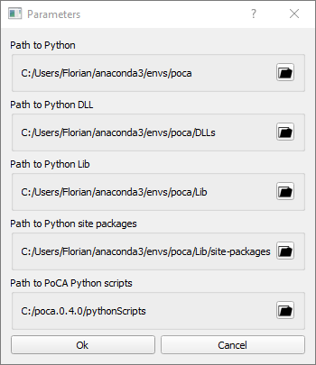
</p>

### Executing a Python script

After loading a localization dataset, a ***Python*** tab is available. At that time the ***Python//Predefined modules*** is empty.

<p align="center">
	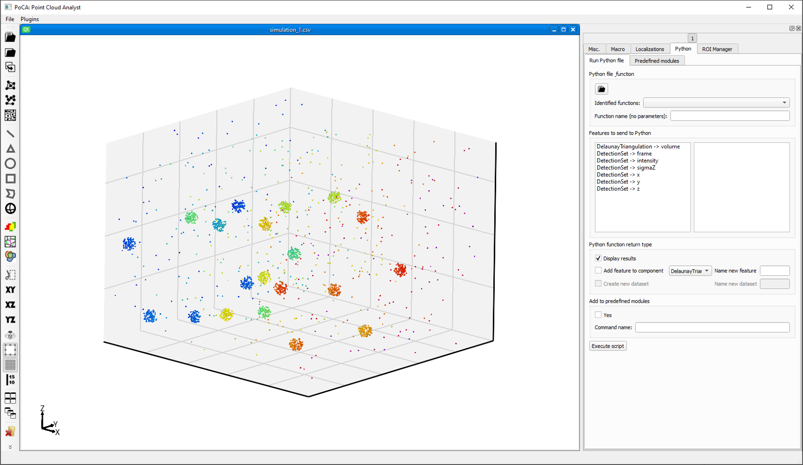
</p>

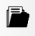&ensp;Open a Python script (required to be in the path defined in the Python parameters).

<p align="center">
	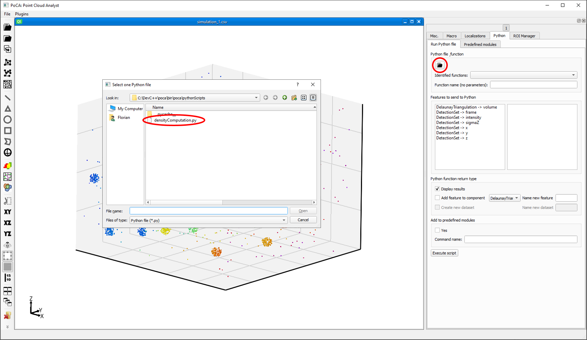
</p>

In this case, the densityComputation.py contains a Python function to compute a local density depending on a fixed radius (in the script), by using a kdtree.

<p align="left">
	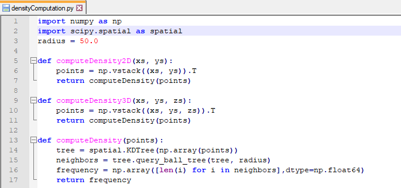
</p>

This script can be applied in 2D or 3D, i.e. it requires the ***x*** and ***y*** features for 2D and the ***x***, ***y*** and ***z*** features for 3D. If you want to compute the density on a 3D point clouds, you have to choose the ***computeDensity3D*** function.

<p align="center">
	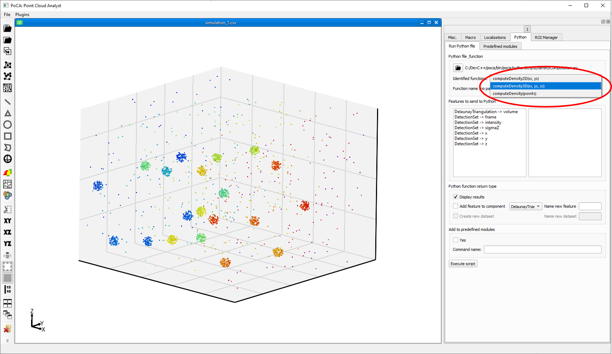
</p>

It will automatically fills the ***function name***. If the function was not in the ***identified functions*** list, you can fill it in the textbox. Currently, PoCA can only transfer 1 dimensional arrays to Python: only ***computeDensity2D*** and ***computeDensity3D*** can be used and ***computeDensity*** is an internal function that have a multidimensional array as input. Then you need to specify the features sent to PoCA by drag dropping them (in this case DetectionSet -> x, DetectionSet -> y and DetectionSet -> z. Finally, both ***computeDensity2D*** and ***computeDensity3D*** returns a 1-dimensional array (the computed density). You thus need to specify in which component it should be added, and with what name.

<p align="center">
	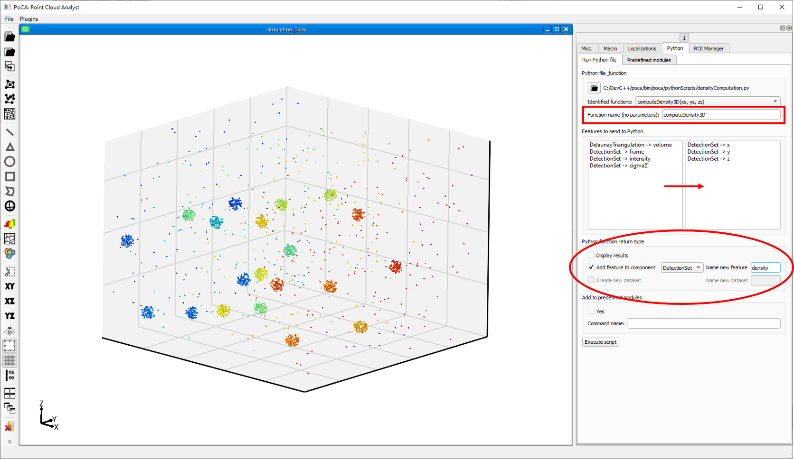
</p>

By checking the ***Yes*** checkbox in the ***Add to predefined modules***, you will add a button to the ***Predefined modules*** tab, that will keep all the communication information. 

<p align="center">
	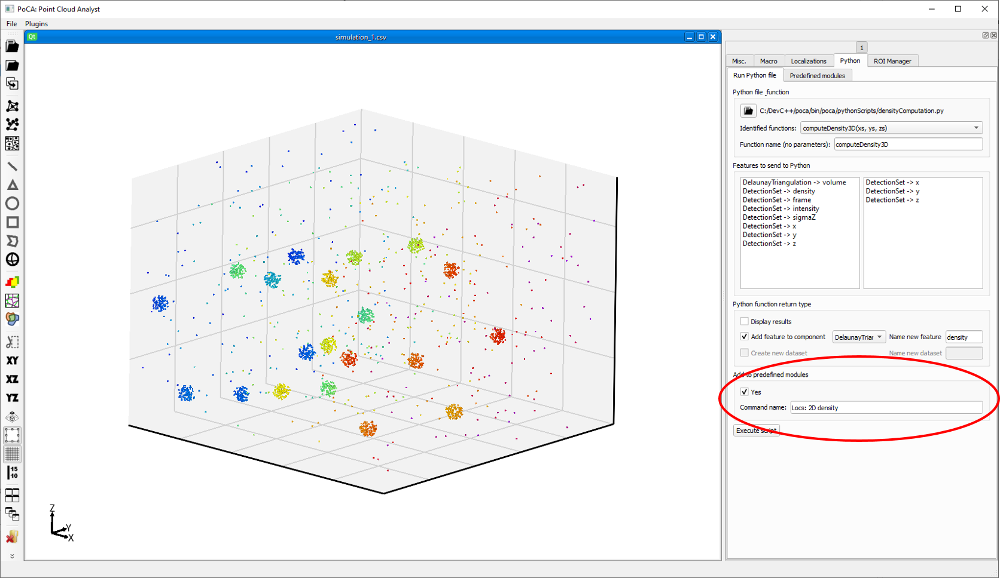
</p>

<p align="left">
	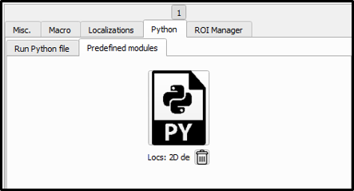
</p>

After clicking on ***Execute script*** and running the script, a new **density** feature is added to the ***Localizations***.

<p align="center">
	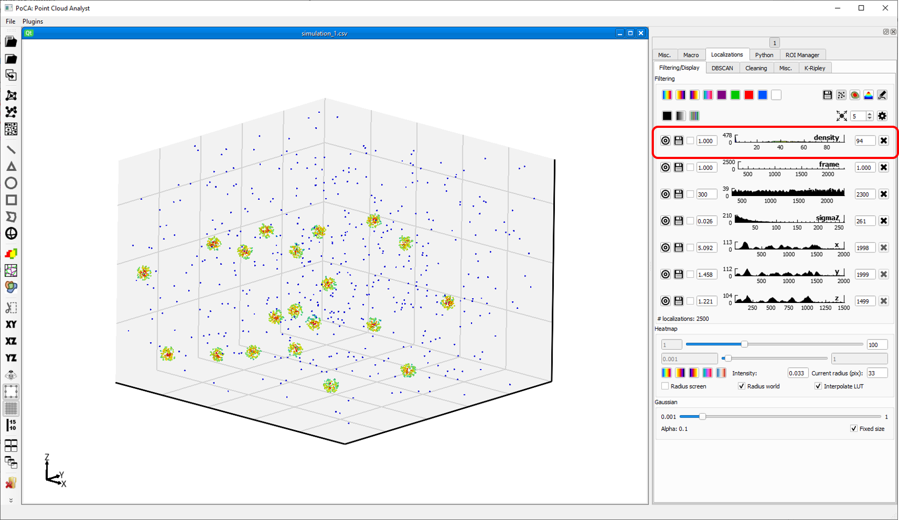
</p>

[Back to main page](README.md)