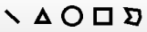
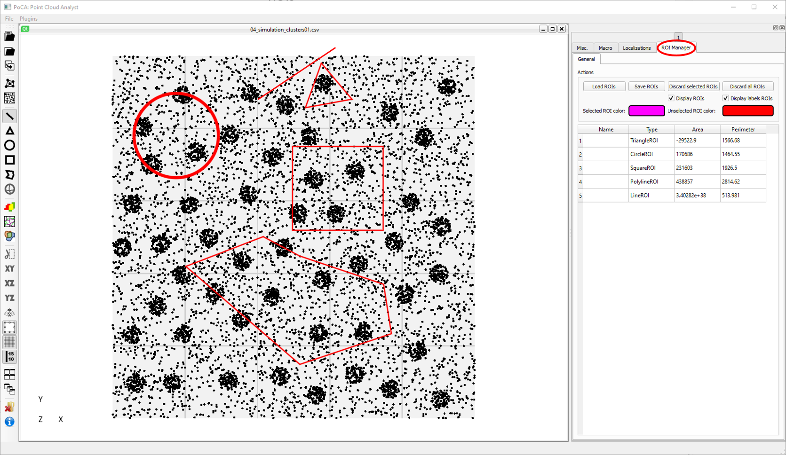
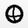
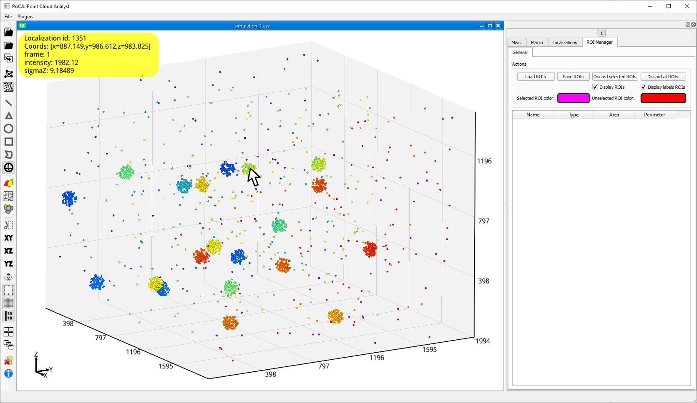
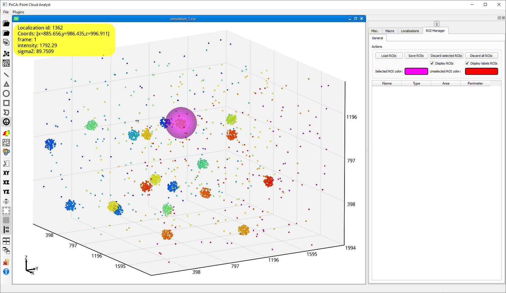
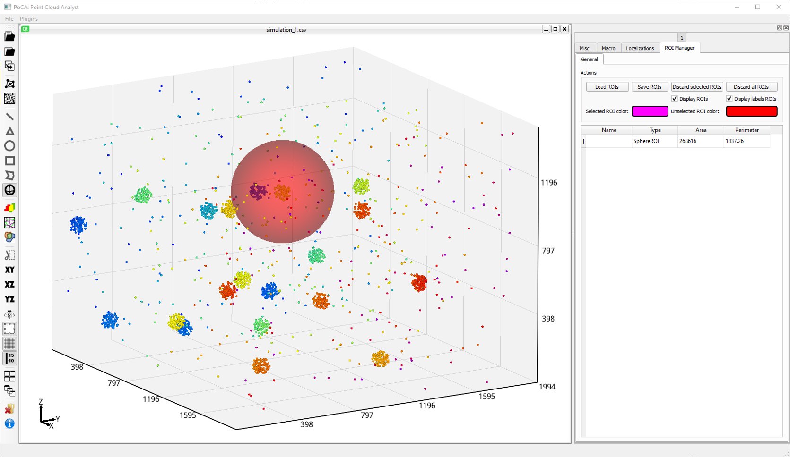
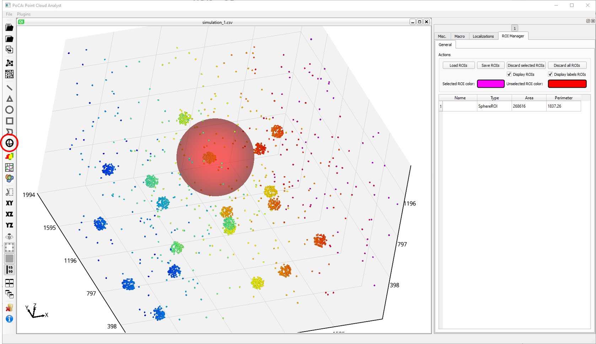

ROIs can be used in some of the algorithms, such as for delineating the regions in which objects are created.

### 2D

&ensp;ROIs available for 2D datasets (line, triangle, circle, square and polyline).

Beware: when using the ***polyline*** ROI, you currently need to have at least created (by left clicking) 3 points for the polyline to be displayed.

	

ROIs are available in the ***ROI Manager*** tab. You can load, save and discard ROIs.

### 3D

Currently, only one ROI is available for 3D datasets.

&ensp;Sphere ROI.

Because of the 3D view, one pixel on the screen corresponds to a line in the 3D world, i.e. an infinity of points. To be able to select a starting point for the sphere, localizations have to be displayed and picking available. When a localization is picked and the ***Sphere ROI*** selected, first press the mouse left button.

	

Then hold and move the mouse cursor to the desired sphere ROI size.

	

Releasing the button will create the sphere ROI.

	

Don't forget to de-select the ***Sphere ROI*** button to be able to rotate the dataset again.

	

[Back to main page](README.md)