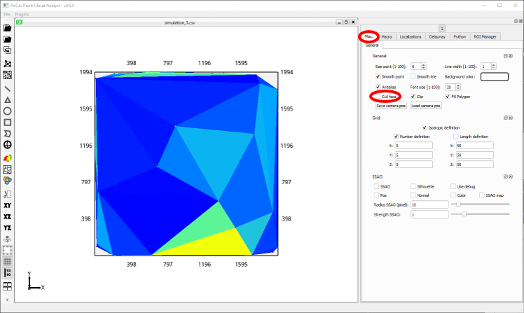
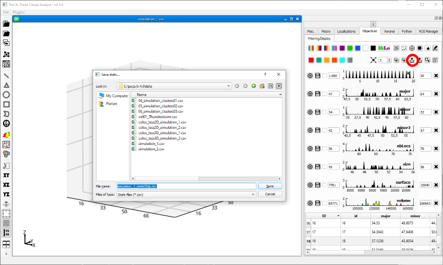

* Open a localization dataset (for instance ***simulation_1.csv*** in the folder ***data***, check Section [Opening localization files](opening.md)).

	

* Create a Delaunay triangulation (check Section on [Delaunay triangulation](delaunay.md))

	

* When rendering the Delaunay triangulation, please make sure that the ***Cull face*** is not selected. Culling is an OpenGL process that will not rendering some triangles depending on their orientation. When on, it may seem like some tetrahedra were not computed.

	

* Chnage the volume feature to logarithmic distribution and toggle off the rendering of the localizations (check the [Voronoi use case](useCase_clustering_voronoi.md) for more information). Then apply a cutting distance, in this case 45 nm. This distance may be different depending on your data. 

	

* If the thresholding is fine, create objects and toggle the Delaunay rendering off.

	

* Save the objects' statistics.

	

You can find the corresponding macro [here](./macros/macro_use_case_delaunay.txt).

[Back to main page](README.md)