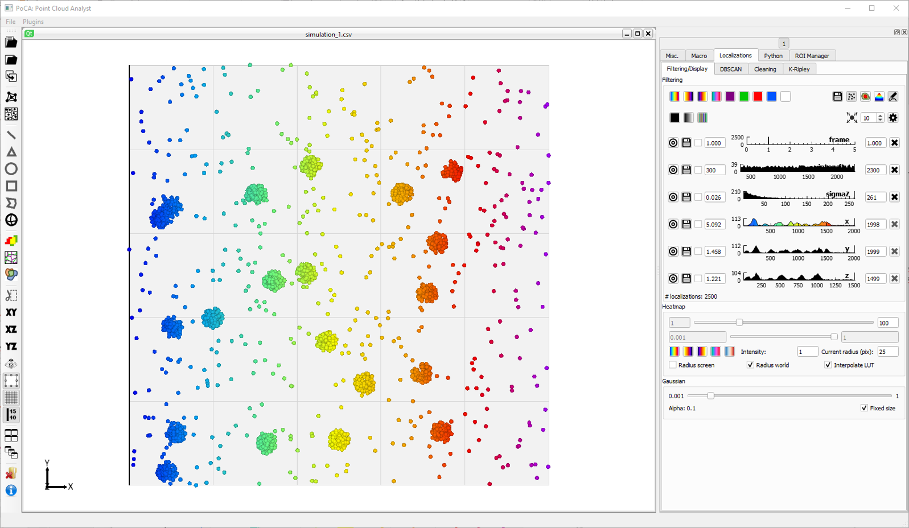
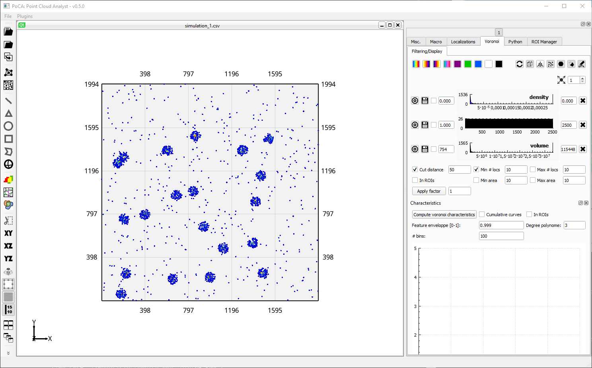
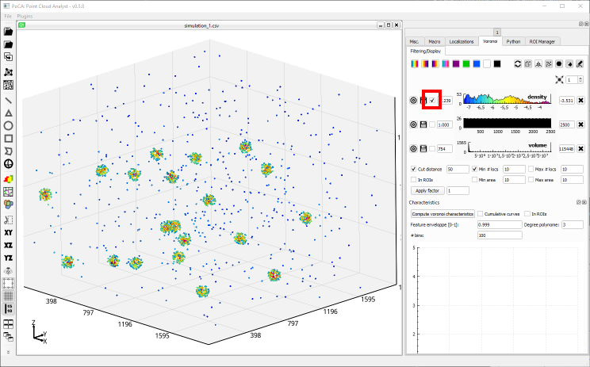
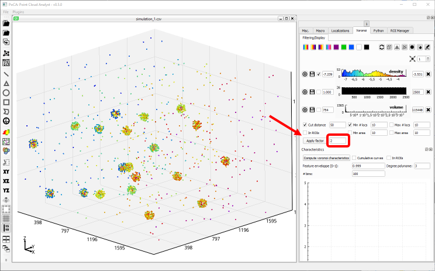
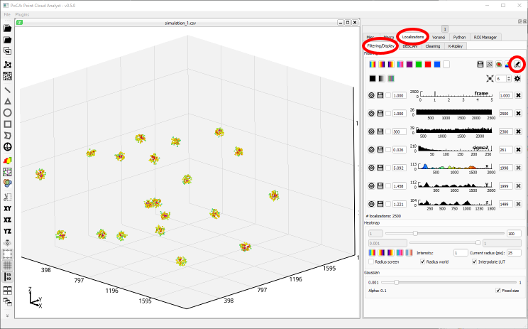
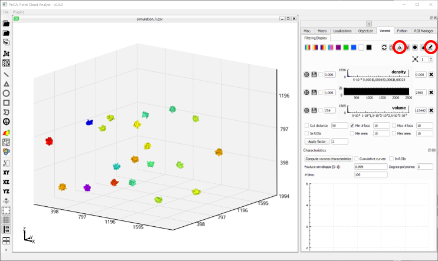
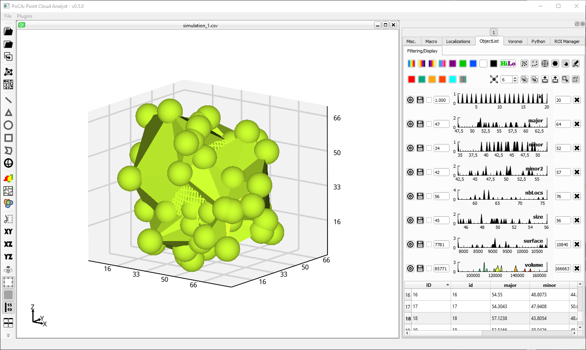
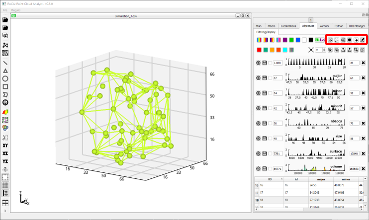
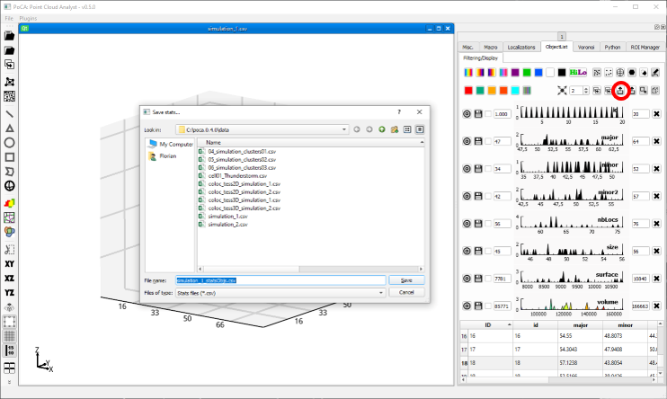

* Open a localization dataset (for instance ***simulation_1.csv*** in the folder ***data***, check Section [Opening localization files](opening.md)).

	

* Create a Voronoi diagram (check Section on [Voronoi diagram](voronoi.md))

	

* Change the density feature to a logarithmic distribution

	

* Apply a density factor, in this case 2 (check the [SR-Tesseler paper](https://doi.org/10.1038/nmeth.3579) for more information). This factor may be different depending on your data. 

	

* Localizations with a density higher than the threshold have been discarded. Nevertheless, it is currently not seen because the rendering of the original localizations have not been unselected. Go to the ***Localizations//Filtering/Display*** tab and click on the ***Toggle display*** button.

	

* If the thresholding is fine, create objects and toggle the Voronoi rendering off.

	

* Pick one object and magnify it (by double clicking on it)

	

* Each object is represent by its localizations, its shape, its localizations that are part of its surface and an ellipsoid that represents the object size (for 3D objects). You can click on the corresponding buttons to toggle the renderings.

	

* Save the objects' statistics.

	

You can find the corresponding macro [here](./macros/macro_use_case_voronoi.txt).

[Back to main page](README.md)