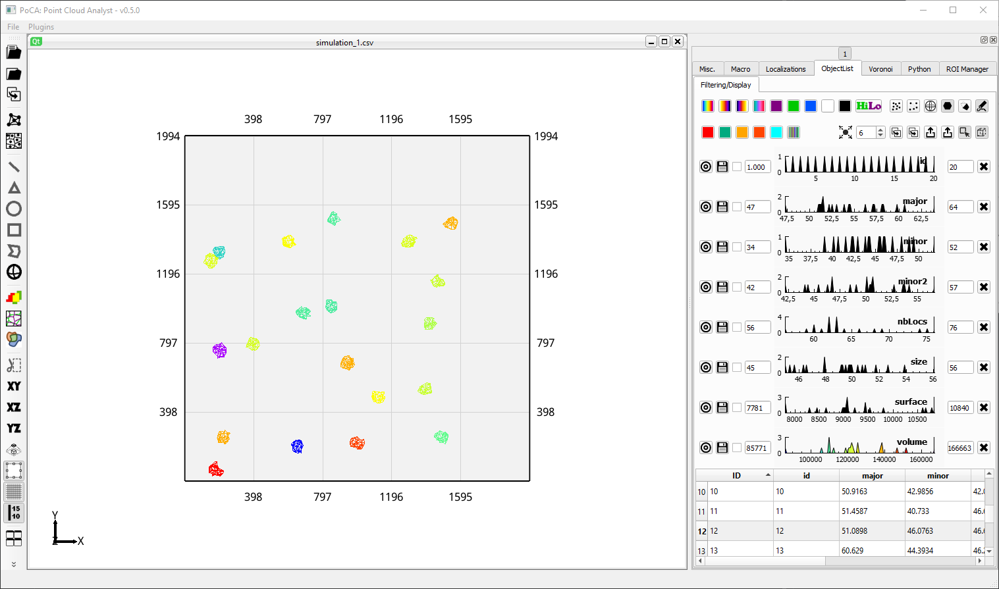
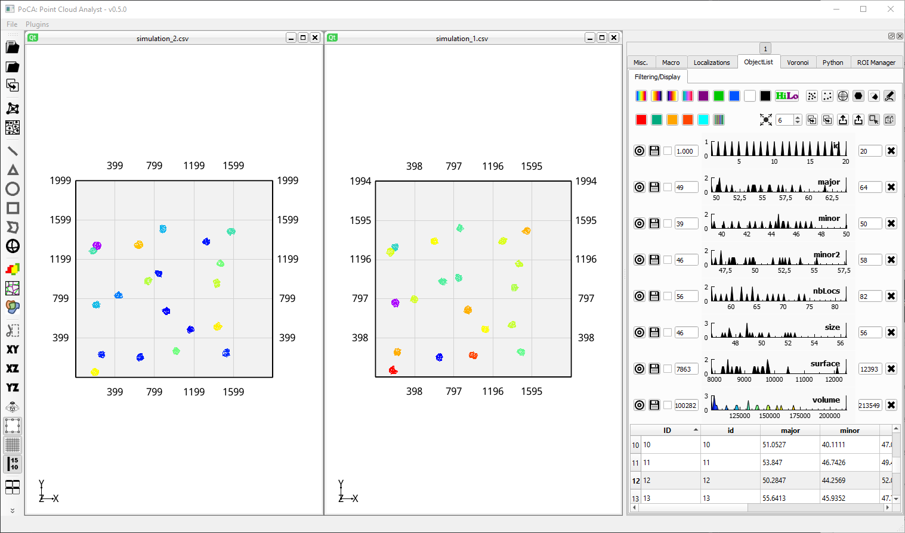
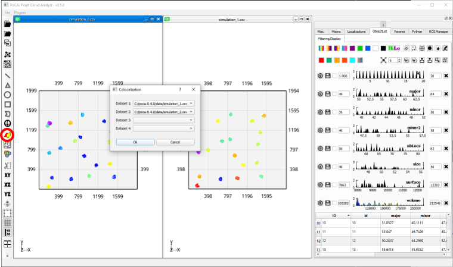
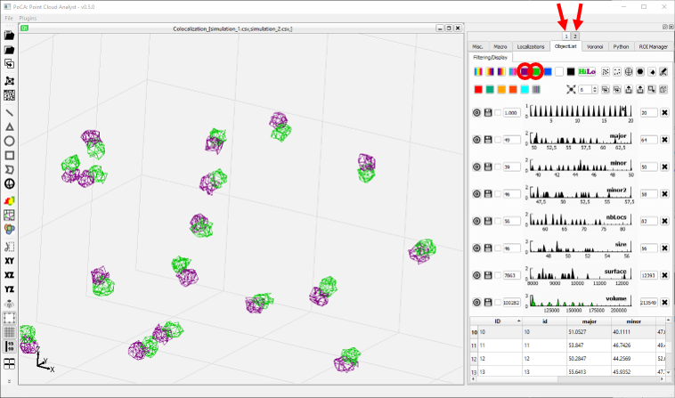
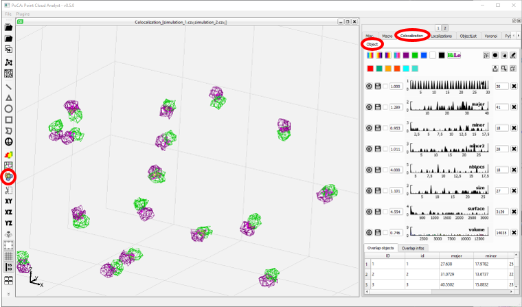

* Follow the steps of the [Voronoi use case](useCase_clustering_voronoi.md) with the localization dataset ***simulation_1.csv***.

	

* Do the same for the localization dataset ***simulation_2.csv***.

	

* Create a colocalization dataset.

	

* Switch the LUT of the color 1 objects to ***Magenta*** and the LUT of the color 2 objects to ***Green***. Use the ***1*** and ***2*** buttons to switch between colors.

	

* Click on the ***Object colocalization*** button.

	

* A new **Colocalization//Object*** tab has been created with all the information of the overlap between the objects.

You can find the corresponding macro [here](./macros/macro_use_case_coloc_objects.txt).

[Back to main page](README.md)