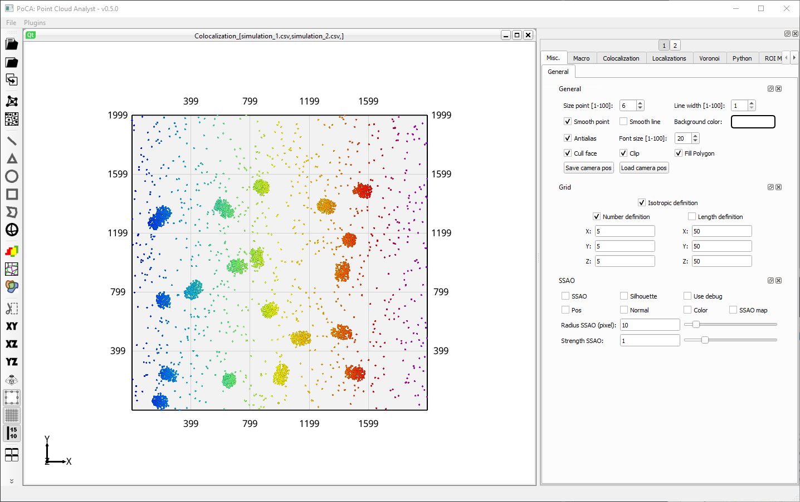

* Open 2 localization datasets (for instance ***simulation_1.csv*** and ***simulation_2.csv***) in the ***data*** folder.

	

* Create a colocalization dataset.

	

* Compute the ***Coloc-Tesseler*** method (check the [paper](https://doi.org/10.1038/s41467-019-10007-4)).

	

* While a ***Colocalization*** tab has been created, we cannot see the classification of Coloc-Tesseler. This is due to the fact that the localizations rendering is still on. We need to toggle it off. Go to the ***Localizations//Filtering/Display*** tabs and use the ***Toggle display*** button. Use the ***1*** and ***2*** buttons to switch between the two colors.

	

* All the localizations are black because no threshold was set. Go to the ***Colocalization//Coloc-Tesseler*** tabs. Apply factors of 1 and 1 for the two colors (clicking on the scatterplot will automatically change these thresholds). Click on ***Apply***.

	

* This has computed the Spearmann and Manders coefficients, and classified all the localizations. Results can be exported by clicking on the **Floppy disk*** button.

	

You can find the corresponding macro [here](./macros/macro_use_case_coloc_tesseler.txt).

[Back to main page](README.md)