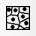
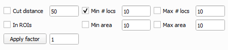
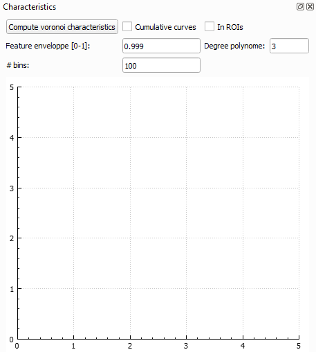

	

&ensp;Clicking the ***Voronoi*** icon in the PoCA toolbar will create a Voronoi diagram of the point cloud, automatically determining if it has to be in 2D or 3D. 

During the construction of the Voronoi diagram, two features are computed: a surface (2D point clouds) or a volume (3D point clouds) feature and a density feature (please refer to the original [SR-Tesseler](https://doi.org/10.1038/nmeth.3579) paper for more explanations). These features can be filtered by the histograms.

List of actions available:

&ensp;Invert selection.

&ensp;Toggle rendering of the bounding box of the picked polygon/polyhedron.

&ensp;Create objects with the current triangles/tetrahedra selected.

&ensp;Toggle rendering of point colored with the Voronoi LUT and feature selected.

&ensp;Toggle rendering of the polygons/polyhedra.

&ensp;Fill or not the surface of the polygons/polyhedra.

&ensp;Toggle rendering of the Voronoi diagram.

	

When using the Voronoi diagram the segmentation can be performed by filtering the feature histogram, applying a cutting distance or applying a density factor (please refer to the original [SR-Tesseler](https://doi.org/10.1038/nmeth.3579) paper for more explanations). Parameters for the creation of objects are available in the section shown above.

The ***Characteristics*** section implements an upgrade of the [ClusterVisu](https://doi.org/10.1038/srep24084) technique and is under development.

	

[Back to main page](README.md)